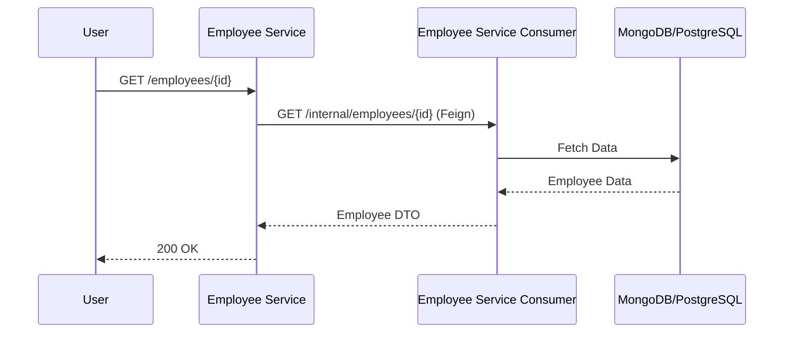
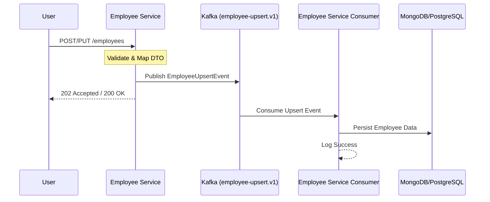
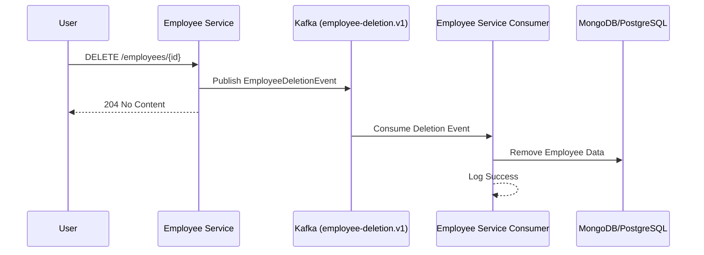

# Employee CRUD Event-Driven System

An event-driven microservices application for managing employee records, featuring asynchronous processing, OAuth2 security, and multi-database persistence.

## Table of Contents
- [Introduction](#introduction)
- [Architecture](#architecture)
- [Project Structure](#project-structure)
- [Requirements](#requirements)
- [How to Run Locally](#how-to-run-locally)
- [Process Flows](#process-flows)
- [User Management](#user-management)
- [API Testing (Bruno)](#api-testing-bruno)
- [Technologies Used](#technologies-used)

---

## Introduction
This project demonstrates a modern, scalable approach to CRUD operations using an **Event-Driven Architecture (EDA)**. Instead of traditional synchronous persistence, the system decoupling operations via **Apache Kafka**, ensuring high availability and system resilience.

---

## Architecture
The system is composed of several decoupled components:

1.  **Employee Service (Producer)**:
    - Exposes REST APIs for Employee management.
    - **Read Operations**: Queries the Employee Service Consumer via REST (Feign) for GET and LIST requests.
    - **Write Operations**: Validates requests and publishes events to Kafka for CREATE, UPDATE, and DELETE.
    - Acts as an OAuth2 Resource Server.
2.  **Employee Service Consumer (Consumer)**:
    - Listens to Kafka topics (`employee-upsert.v1`, `employee-deletion.v1`).
    - Handles data persistence and background tasks.
    - **Data Access**: Exposes REST endpoints used by the Producer for read operations.
3.  **Users Service**:
    - Dedicated microservice for user management.
    - Exposes REST APIs for user CRUD operations.
    - Communicates with IAM Service (Keycloak) via Feign client.
    - Acts as an OAuth2 Resource Server.
4.  **Employee API**:
    - A shared module providing common DTOs, interfaces, and utility classes used by both services.
5.  **Infrastructure**:
    - **Kafka & Zookeeper**: Message broker for asynchronous event delivery.
    - **Keycloak**: Centralized Identity and Access Management (IAM).
    - **MongoDB & PostgreSQL**: Used for persistent storage.

---

## Project Structure
```text
.
├── docker/                      # Infrastructure configuration (Docker Compose, Keycloak, Nginx)
│   ├── keycloak-compose.yml     # Main infrastructure definition
│   └── ...
├── employee-api/                # Shared module (DTOs, Common Logic)
├── employee-service/            # Producer service (REST API + Kafka Producer)
├── employee-service-consumer/   # Consumer service (Kafka Consumer + Persistence)
├── users-service/              # Users service (User Management + IAM Integration)
├── .bruno/                      # Bruno API collection for testing
├── pom.xml                      # Root Maven configuration
└── README.md                    # Project documentation
```

---

## Requirements
- **Java 21**
- **Maven 3.8+**
- **Docker & Docker Compose**
- **Hosts File**: Add the following entry to your `/etc/hosts`:
  ```text
  127.0.0.1 localstack.lks.com
  ```

---

## How to Run Locally

### 1. Start Infrastructure
Launch the required services (Kafka, Mongo, Postgres, Keycloak) using Docker Compose:
```bash
cd docker
docker compose -f keycloak-compose.yml up -d
```

### 2. Build the Project
Compile and install all modules from the root directory:
```bash
./mvnw clean install
```

### 3. Run the Services
Open three terminals and run the following:

**Terminal 1: Employee Service**
```bash
cd employee-service
./mvnw spring-boot:run -Dspring-boot.run.profiles=local
```

**Terminal 2: Employee Consumer**
```bash
cd employee-service-consumer
./mvnw spring-boot:run -Dspring-boot.run.profiles=local
```

**Terminal 3: Users Service**
```bash
cd users-service
./mvnw spring-boot:run
```

### Default Users

The following users are pre-configured in the `dev` realm:

- **John Doe** (`john@test.com` / `123`): Has **`manage-users`**, **`view-users`**, **`query-users`** client roles in realm-management. Authorized to perform all user management and employee CRUD operations.
- **Mike Smith** (`mike@other.com` / `123`): Has only **`account`** client roles. Authorized for employee operations but restricted from user management.

---

## Process Flows

### Read Operations (GET/LIST)


### Employee Upsert Flow (Create/Update)


### Employee Deletion Flow


---

## User Management

The Users Service provides dedicated user management capabilities that integrate with the IAM Service (Keycloak) for centralized identity and access management.

### User Endpoints

The Users Service exposes the following user management endpoints under `/users`:

- **POST /users** - Create a new user
- **GET /users/{id}** - Get user by ID
- **GET /users/username/{username}** - Get user by username
- **GET /users/{page}/{size}** - Get all users with pagination
- **PUT /users/{id}** - Update user
- **DELETE /users/{id}** - Delete user

The IAM Service provides endpoints for user management (require OAuth2 authentication):

- **POST /api/users** - Create a new user
- **GET /api/users/{page}/{size}** - List all users with pagination
- **GET /api/users/{id}** - Get user by ID
- **GET /api/users/username/{username}** - Get user by username
- **PUT /api/users/{id}** - Update user details and roles
- **DELETE /api/users/{id}** - Delete a user

### Role-Based Access Control (RBAC)

All user management endpoints are protected with role-based access control using Spring Security's `@PreAuthorize` annotations. The following roles are required:

| Operation | Required Roles |
|-----------|----------------|
| Create User | `admin`, `manage-users` |
| Get User by ID | `admin`, `manage-users`, `view-users`, `query-users` |
| Get User by Username | `admin`, `manage-users`, `view-users`, `query-users` |
| Get All Users | `admin`, `manage-users`, `view-users`, `query-users` |
| Update User | `admin`, `manage-users` |
| Delete User | `admin`, `manage-users` |

### Keycloak Integration

The user management functionality communicates with the IAM Service (Keycloak) via Feign client. The IAM Service handles:

- User creation and deletion in Keycloak
- User attribute management
- Role assignment (realm roles and client roles)
- Email verification status
- User enable/disable operations

### Configuration

The IAM Service base URL is configured in `application.yml`:

```yaml
services:
  iam-service:
    base-url: http://localhost:8082
```

The Users Service runs on port 8084 by default.

### Data Synchronization

When users are created, updated, or deleted through the Users Service:
1. The request is validated and processed
2. The Feign client communicates with the IAM Service
3. The IAM Service performs the actual operations in Keycloak
4. User data is synchronized between Keycloak and the application

### Security

All user endpoints require:
- Bearer token authentication (JWT from Keycloak)
- Appropriate role assignments as specified in the RBAC table above
- OAuth2 Resource Server configuration

---

## API Testing (Bruno)

The project includes a [Bruno](https://www.usebruno.com/) collection for testing the API endpoints.

### Setup
1.  Install the **Bruno** API client.
2.  Open Bruno and select **Open Collection**.
3.  Navigate to the `.bruno/` directory in this project.
4.  Select the `local` environment from the environment dropdown to set the base URL and authentication variables.

### Available Requests
- **Auth**: `GetToken`, `GetToken User 2`
- **Employee CRUD**: `ListEmployees`, `GetEmployee`, `CreateEmployee`, `UpdateEmployee`, `DeleteEmployee`
- **User Management**: `CreateUser`, `GetUserById`, `GetUserByUsername`, `GetAllUsers`, `UpdateUser`, `DeleteUser`
- **Health**: `health`

---

## Technologies Used
- **Backend**: Spring Boot 3.4.4, Java 21
- **Security**: Keycloak (OAuth2, OpenID Connect, JWT)
- **Messaging**: Apache Kafka & Zookeeper
- **Persistence**: MongoDB, PostgreSQL (Spring Data JPA)
- **API Documentation**: SpringDoc OpenAPI (Swagger)
- **Testing**: Bruno API Client, JUnit 5, Testcontainers
- **Infrastructure**: Docker, Nginx
