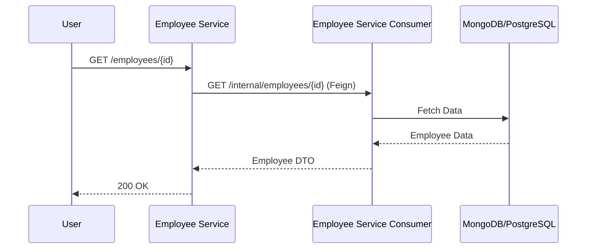
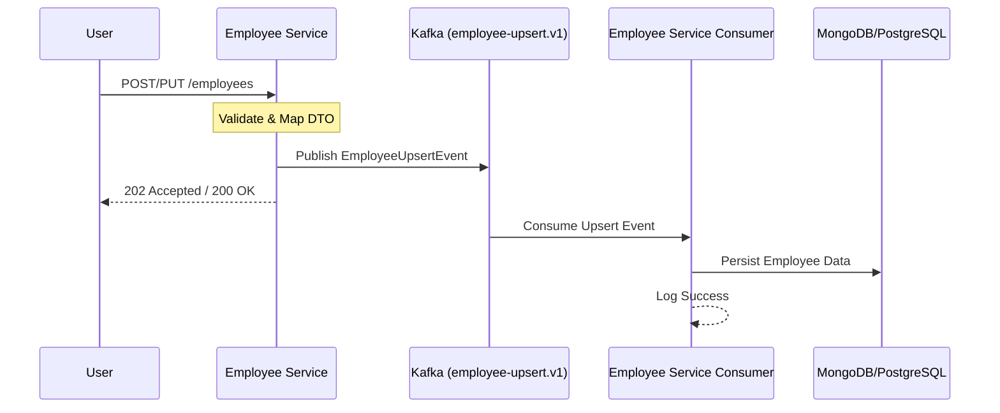
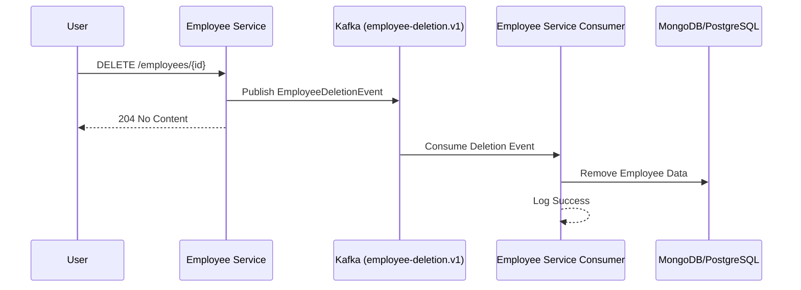

# Employee CRUD Event-Driven System

An event-driven microservices application for managing employee records, featuring asynchronous processing, OAuth2 security, and multi-database persistence.

## Table of Contents
- [Introduction](#introduction)
- [Architecture](#architecture)
- [Project Structure](#project-structure)
- [Requirements](#requirements)
- [How to Run Locally](#how-to-run-locally)
- [Process Flows](#process-flows)
- [API Testing (Bruno)](#api-testing-bruno)
- [Technologies Used](#technologies-used)

---

## Introduction
This project demonstrates a modern, scalable approach to CRUD operations using an **Event-Driven Architecture (EDA)**. Instead of traditional synchronous persistence, the system decoupling operations via **Apache Kafka**, ensuring high availability and system resilience.

---

## Architecture
The system is composed of several decoupled components:

1.  **Employee Service (Producer)**:
    - Exposes REST APIs for Employee management.
    - **Read Operations**: Queries the Employee Service Consumer via REST (Feign) for GET and LIST requests.
    - **Write Operations**: Validates requests and publishes events to Kafka for CREATE, UPDATE, and DELETE.
    - Acts as an OAuth2 Resource Server.
2.  **Employee Service Consumer (Consumer)**:
    - Listens to Kafka topics (`employee-upsert.v1`, `employee-deletion.v1`).
    - Handles data persistence and background tasks.
    - **Data Access**: Exposes REST endpoints used by the Producer for read operations.
3.  **Employee API**:
    - A shared module providing common DTOs, interfaces, and utility classes used by both services.
4.  **Infrastructure**:
    - **Kafka & Zookeeper**: Message broker for asynchronous event delivery.
    - **Keycloak**: Centralized Identity and Access Management (IAM).
    - **MongoDB & PostgreSQL**: Used for persistent storage.

---

## Project Structure
```text
.
├── docker/                      # Infrastructure configuration (Docker Compose, Keycloak, Nginx)
│   ├── keycloak-compose.yml     # Main infrastructure definition
│   └── ...
├── employee-api/                # Shared module (DTOs, Common Logic)
├── employee-service/            # Producer service (REST API + Kafka Producer)
├── employee-service-consumer/   # Consumer service (Kafka Consumer + Persistence)
├── .bruno/                      # Bruno API collection for testing
├── pom.xml                      # Root Maven configuration
└── README.md                    # Project documentation
```

---

## Requirements
- **Java 21**
- **Maven 3.8+**
- **Docker & Docker Compose**
- **Hosts File**: Add the following entry to your `/etc/hosts`:
  ```text
  127.0.0.1 localstack.lks.com
  ```

---

## How to Run Locally

### 1. Start Infrastructure
Launch the required services (Kafka, Mongo, Postgres, Keycloak) using Docker Compose:
```bash
cd docker
docker compose -f keycloak-compose.yml up -d
```

### 2. Build the Project
Compile and install all modules from the root directory:
```bash
./mvnw clean install
```

### 3. Run the Services
Open two terminals and run the following:

**Terminal 1: Employee Service**
```bash
cd employee-service
./mvnw spring-boot:run -Dspring-boot.run.profiles=local
```

**Terminal 2: Employee Consumer**
```bash
cd employee-service-consumer
./mvnw spring-boot:run -Dspring-boot.run.profiles=local
```

---

## Process Flows

### Read Operations (GET/LIST)


### Employee Upsert Flow (Create/Update)


### Employee Deletion Flow


---

## API Testing (Bruno)

The project includes a [Bruno](https://www.usebruno.com/) collection for testing the API endpoints.

### Setup
1.  Install the **Bruno** API client.
2.  Open Bruno and select **Open Collection**.
3.  Navigate to the `.bruno/` directory in this project.
4.  Select the `local` environment from the environment dropdown to set the base URL and authentication variables.

### Available Requests
- **Auth**: `GetToken`, `GetToken User 2`
- **Employee CRUD**: `ListEmployees`, `GetEmployee`, `CreateEmployee`, `UpdateEmployee`, `DeleteEmployee`
- **Health**: `health`

---

## Technologies Used
- **Backend**: Spring Boot 3.4.4, Java 21
- **Security**: Keycloak (OAuth2, OpenID Connect, JWT)
- **Messaging**: Apache Kafka & Zookeeper
- **Persistence**: MongoDB, PostgreSQL (Spring Data JPA)
- **API Documentation**: SpringDoc OpenAPI (Swagger)
- **Testing**: Bruno API Client, JUnit 5, Testcontainers
- **Infrastructure**: Docker, Nginx
